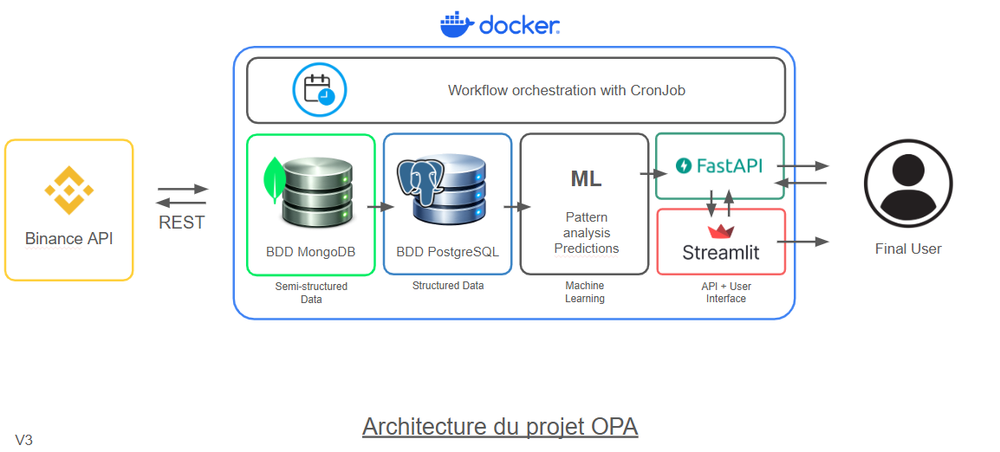

# OPA – CryptoBot

# Présentation du projet

CryptoBot est une application de data engineering et d’analyse de données crypto qui collecte, transforme et visualise des données de marché provenant de l’API Binance.

Le projet met en œuvre une architecture complète comprenant :

ingestion de données via API
stockage NoSQL
pipeline ETL
base analytique SQL
API REST
dashboard interactif
modèle de Machine Learning pour générer des signaux de trading.

L’objectif est de construire une architecture de pipeline de données complète et modulaire, proche des pratiques utilisées en production.

---

## Architecture

---

## Fonctionnalités

Le projet permet de :

- collecter des données crypto depuis l’API Binance
- stocker les données brutes dans MongoDB
- transformer les données avec un pipeline ETL
- calculer des indicateurs techniques (EMA, RSI, volatilité)
- exposer les données via une API REST
- visualiser les données dans un dashboard interactif
- générer des signaux de trading via un modèle de Machine Learning.

---

## Technologies utilisées

Data Engineering
- Python
- Pandas
- Numpy

Stockage
- MongoDB (données brutes)
- PostgreSQL (données transformées)

Backend
- FastAPI

Visualisation
- Streamlit
- Plotly

Machine Learning
- Scikit-learn
- Naive Bayes Classifier

Infrastructure
- Docker
- Docker Compose
- Cron Jobs

---

## Structure du projet
project/
│
├── dashboard/
│   ├── app.py                # visualisation avec streamlit
│   ├── label_encoder.pkl     # décodeur du label
│   └── model_ML_NBC.pkl      # modèle ML entraîné
│
├── src/
│   ├── api/                  # API FastAPI
│   ├── etl/                  # pipeline ETL
│   ├── storage/              # connexions DB
│   ├── processors/           # transformations
│   └── collectors/           # récupération données binance
│
├── scripts/
│   ├── ingest_historical.py  # définition de fonction utile pour l'ingestion
│   ├── update_latest.py      # ingestion de nouvelles données
│   ├── repair_gaps.py        # ingestion de données pour combler les éventuels "trous" dans nos base de données
│   ├── first_ingestion.py    # ingestion des toutes premières données
│   └── run_etl.py            # lancer les scripts prévu pour l'etl
│
├── docker-compose.yml
├── docker-entrypoint-app.sh
├── docker-entrypoint-scheduler.sh
├── crontab.docker
├── Dockerfile
├── Dockerfile.api
├── Dockerfile.dashboard
└── README.md

---
## Lancer le projet

Prérequis
- Docker
- Docker Compose

Lancer l’application
docker compose up --build

Accéder aux services

API FastAPI

http://localhost:8000/docs

Dashboard Streamlit

http://localhost:8501

---

## Machine Learning
Un modèle de classification Naive Bayes est utilisé pour générer des signaux de trading :
- BUY
- SELL
- HOLD

Les features utilisées incluent :
- variation du prix
- moyenne mobile
- volatilité

Le modèle est chargé dans le dashboard via joblib.

---

## Auteurs

Projet réalisé dans le cadre du cours de Data Engineering.
Albert / Coline / Deborah / Jihane