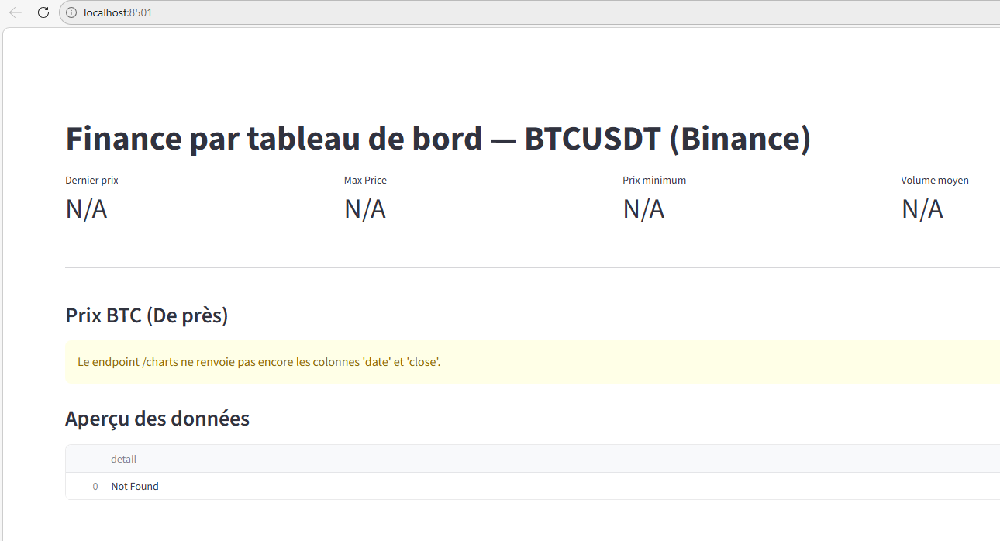
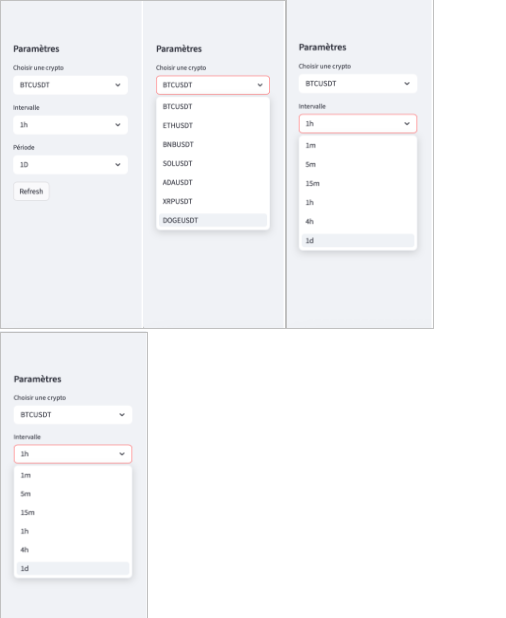
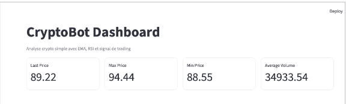
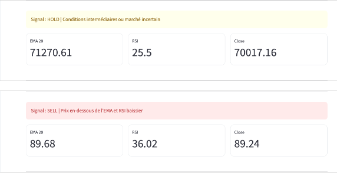
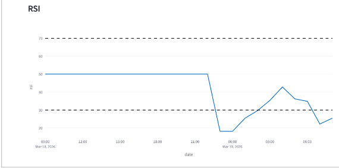

# 8. Dashboard Streamlit

Le dashboard du projet CryptoBot a été développé avec Streamlit afin de visualiser les données issues du pipeline de Data Engineering.

Il constitue la couche de visualisation finale du pipeline.

## Architecture du pipeline

Binance API  
↓  
MongoDB  
↓  
ETL Python  
↓  
PostgreSQL  
↓  
FastAPI  
↓  
Streamlit Dashboard  

---

## Lancement du dashboard


Le dashboard est lancé via Streamlit, permettant d’accéder à une interface web interactive.

---

## Interface du dashboard



Le dashboard permet de visualiser les données de marché et les résultats du modèle.

---
## Paramétrage



La sidebar permet à l’utilisateur de sélectionner :

- la cryptomonnaie (BTCUSDT, ETHUSDT…)
- l’intervalle temporel (1m, 5m, 1h…)
- la période d’analyse (1D, 1W…)

Cela permet de personnaliser l’analyse des données.

Cette fonctionnalité rend le dashboard interactif et permet à l’utilisateur d’adapter l’affichage en fonction de ses besoins.

## Indicateurs clés



Cette interface présente les principaux indicateurs de marché affichés dans le dashboard.

La fonction `st.metric()` permet d’afficher des indicateurs clés de performance sous forme de cartes visuelles.

Dans ce dashboard, plusieurs indicateurs sont affichés :

- Last Price
- Max Price
- Min Price
- Average Volume

Ces indicateurs permettent d’obtenir une lecture rapide et synthétique de l’état du marché.

---

### Code des indicateurs

```python
# Stats
col1, col2, col3, col4 = st.columns(4)
col1.metric("Last Price", round(stats["last_price"], 2))
col2.metric("Max Price", round(stats["max_price"], 2))
col3.metric("Min Price", round(stats["min_price"], 2))
col4.metric("Average Volume", round(stats["avg_volume"], 2))

st.divider()

## Signal de trading



Le dashboard affiche un signal de trading récupéré depuis l’API FastAPI.

Trois types de signaux peuvent être affichés :

- BUY → signal d’achat  
- SELL → signal de vente  
- HOLD → attente  

Ces signaux permettent d’aider l’utilisateur à interpréter la tendance du marché et à prendre des décisions.

Ils offrent une synthèse visuelle des indicateurs techniques et facilitent l’analyse rapide du marché.

---

### Explication technique

Le signal est calculé à partir de plusieurs indicateurs techniques :

- EMA → permet d’analyser la tendance du marché  
- RSI → permet d’identifier les zones de surachat ou de survente  

En fonction de ces conditions, le système génère automatiquement un signal de trading.

Cette approche permet de transformer les données de marché en informations exploitables pour l’utilisateur.

Elle permet également de simplifier l’interprétation des données complexes grâce à une représentation visuelle claire.

## Visualisation du prix

Un graphique permet d’afficher l’évolution du prix dans le temps :

- axe X → temps  
- axe Y → prix  

Un indicateur EMA est utilisé pour visualiser la tendance.

---
## Analyse RSI



Le RSI (Relative Strength Index) est un indicateur technique utilisé pour mesurer la force d’un mouvement de prix.

Il est affiché avec deux seuils :

- 70 → zone de surachat  
- 30 → zone de survente  

Lorsque le RSI dépasse 70, cela peut indiquer que l’actif est suracheté.  
À l’inverse, lorsqu’il est inférieur à 30, cela peut signaler une zone de survente.

Cet indicateur permet d’anticiper les retournements de tendance du marché.
il est utilisé en complément des autres analyses pour affiner les décisions de trading.

---

### Explication technique

Le RSI est calculé à partir des variations de prix sur une période donnée.

Il permet d’évaluer la vitesse et l’amplitude des mouvements du marché.

Cette information est utilisée dans le système de génération de signaux (BUY / SELL / HOLD).

---

## Données récentes

Un tableau affiche les dernières données :

- df.tail(50)
- affichage interactif

Cela permet de vérifier les données utilisées.
