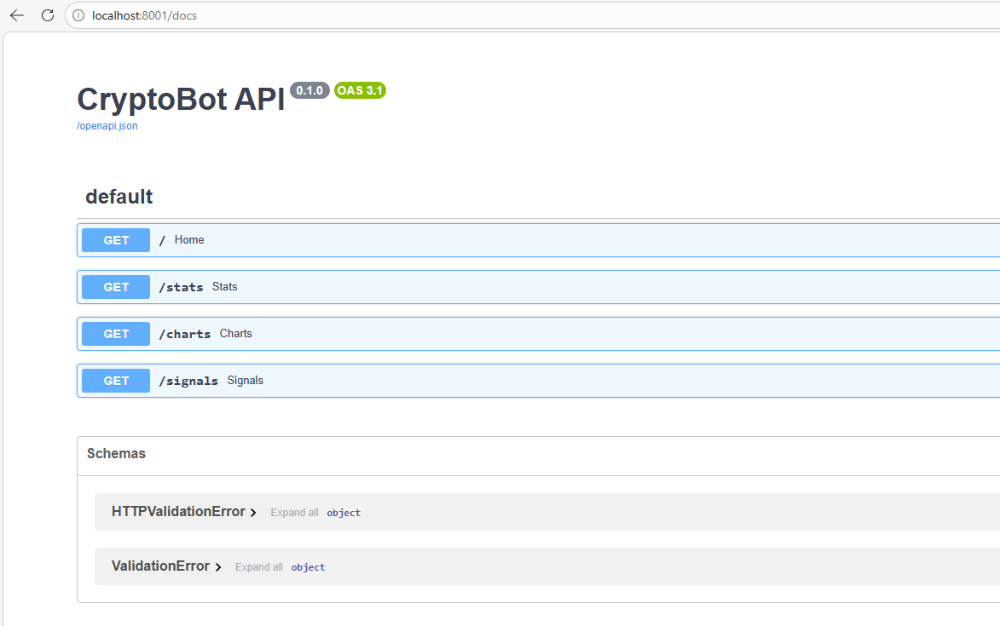

## Exposition des données via API FastAPI

Afin de rendre les données accessibles, une API REST a été développée avec FastAPI.

Cette API permet de :
- récupérer les statistiques (/stats)
- afficher des graphiques (/charts)
- générer des signaux (/signals)

L’interface Swagger permet de tester facilement les endpoints.

